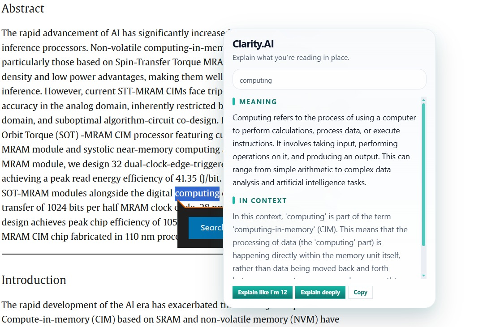

# Clarity.AI

Clarity.AI is an open-source browser extension for understanding what you read without breaking flow.

Highlight a word, phrase, or passage, press your shortcut, and get a clear explanation in context. By default, users can paste their own Gemini API key into the extension settings and run Clarity.AI with no local server. A self-hosted backend is still available as an optional mode.

First public version.

## Why Clarity.AI

- In-place explanations instead of tab switching
- Context-aware responses that use nearby page content
- Direct Gemini mode with no backend required
- Optional self-hosted backend for users who prefer keeping keys out of the extension
- Open-source codebase with no fixed hosted dependency

## Features

- Explains highlighted words, phrases, and passages in plain language
- Uses nearby page context to make explanations more accurate
- Includes `Explain like I'm 12` and `Explain deeply` modes
- Supports copyable results and a context-menu flow for PDFs/browser documents
- Works in `Direct Gemini (no server)` mode or with an optional self-hosted backend

## Install

1. Download ZIP.
2. Extract it.
3. Open `chrome://extensions`.
4. Enable `Developer mode`.
5. Click `Load unpacked`.
6. Select the folder.

## Setup

1. Load the extension.
2. Open the extension settings.
3. Add your API key in settings.
4. Save.
5. Keep the default model unless you want a different one.
6. Highlight text on any page and trigger Clarity.AI with your configured shortcut.

## Optional backend mode

If you prefer not to store the API key in the extension, Clarity.AI can also talk to a self-hosted backend from this repo:

1. Copy `.env.example` to `.env`.
2. Add your Gemini key to `GEMINI_API_KEY`.
3. Start the backend with `npm run dev`.
4. In the settings page, switch to `Self-hosted backend`.
5. Use `http://localhost:3000` as the backend URL.

## Development checks

- Run `npm run check` to syntax-check the extension and backend files.
- Run `npm run dev` only if you want backend mode.
- Reload the unpacked extension after changing files under `src/extension`.

## Project structure

- `manifest.json`: extension manifest kept at the repo root so the whole repo can be loaded unpacked in Chrome
- `src/extension/`: extension runtime, settings pages, result pages, styling, and icons
- `src/backend/server.js`: local backend entry point
- `src/backend/api/`: backend endpoints for `/api/explain` and `/api/health`
- `README.md` and `DEPLOY.md`: primary project documentation

## Configuration

- `GEMINI_API_KEY`: backend mode only; put your real Gemini API key here
- `GEMINI_MODEL`: backend mode only; model name such as `gemini-2.5-flash`
- `PORT`: backend mode only; local backend port, usually `3000`
- `ALLOWED_EXTENSION_ORIGINS`: backend mode only; optional comma-separated allowlist such as `chrome-extension://YOUR_EXTENSION_ID`
- `CLARITY_LOG_PROMPT_METRICS`: backend mode only; optional debug flag; use `true` to enable or `false`/blank to disable

If `ALLOWED_EXTENSION_ORIGINS` is empty, the backend accepts requests from any origin. For a tighter setup, set it to your unpacked or published extension origin, for example `chrome-extension://YOUR_EXTENSION_ID`.

## License

This project is released under the GNU General Public License v3.0. See `LICENSE`.

## Notes

- Normal webpages provide the best context quality.
- Native browser PDF viewers can expose less surrounding context than regular pages.
- Deployment and self-hosting notes are in `DEPLOY.md`.
